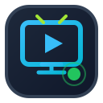
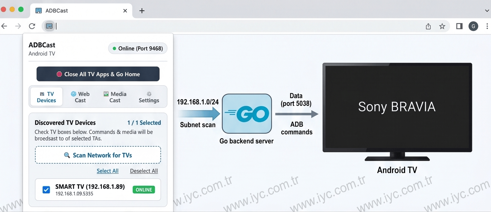
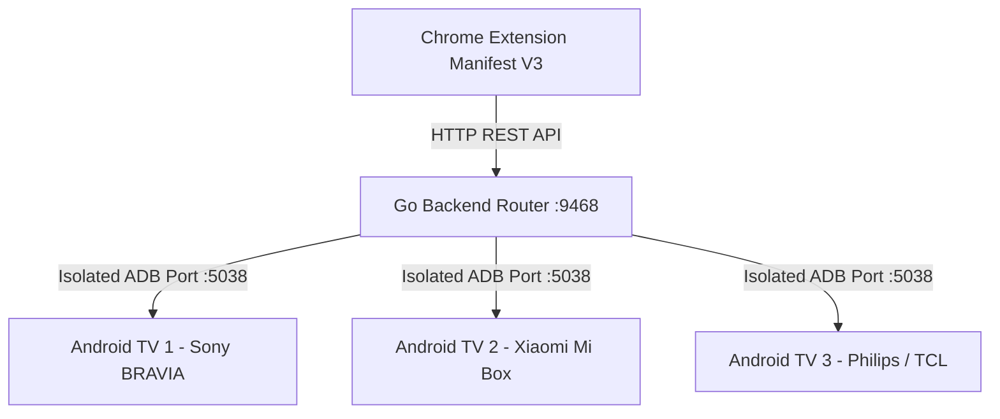
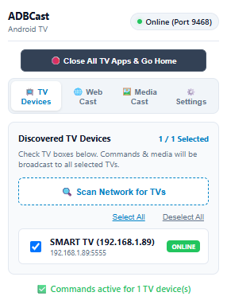
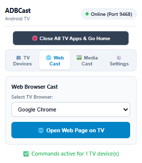
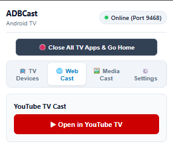
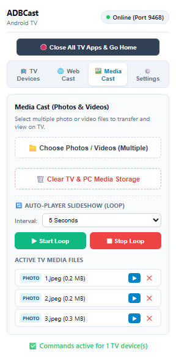
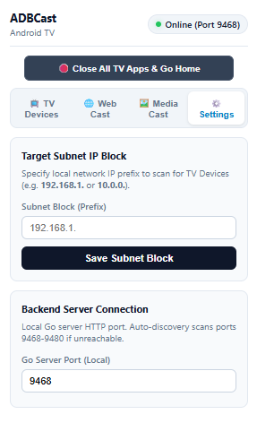

<p align="center">
  
</p>

<h1 align="center">ADBCast Android TV</h1>
<p align="center"><b>Control multiple Android TV devices from your browser using ADB—no TV app required.</b></p>

<p align="center">
  <b>Dynamic Context Router & Multi-Device Cast Manager for Android TV / AOSP Devices</b>
</p>

<p align="center">
  <a href="https://www.iyc.com.tr/"></a>
  <a href="https://www.iyc.com.tr/"></a>
  
  
  
  
  
  
</p>

<p align="center">
  
</p>

<p align="center">
  <a href="https://github.com/FatihSahinSEN/adbcast-android-tv/releases/latest/download/ADBCast-Windows-amd64.zip"></a>
  <a href="https://github.com/FatihSahinSEN/adbcast-android-tv/releases/latest/download/ADBCast-Linux-amd64.tar.gz"></a>
  <a href="https://github.com/FatihSahinSEN/adbcast-android-tv/releases/latest/download/ADBCast-macOS-arm64.tar.gz"></a>
  <a href="https://github.com/FatihSahinSEN/adbcast-android-tv/releases/latest/download/ADBCast-Chrome-Extension.zip"></a>
</p>

### 📦 Latest Pre-built Downloads (GitHub Actions Releases)

| Platform | Download Link | Contents Included |
| :--- | :--- | :--- |
| 🪟 **Windows (x64)** | [ADBCast-Windows-amd64.zip](https://github.com/FatihSahinSEN/adbcast-android-tv/releases/latest/download/ADBCast-Windows-amd64.zip) | Go Server Binary, Platform Tools, Windows Service Installers |
| 🐧 **Linux (x64)** | [ADBCast-Linux-amd64.tar.gz](https://github.com/FatihSahinSEN/adbcast-android-tv/releases/latest/download/ADBCast-Linux-amd64.tar.gz) | Go Server Binary, Platform Tools, Systemd Unit Installer |
| 🍏 **macOS (M1/M2/M3/M4)** | [ADBCast-macOS-arm64.tar.gz](https://github.com/FatihSahinSEN/adbcast-android-tv/releases/latest/download/ADBCast-macOS-arm64.tar.gz) | Apple Silicon Binary, Launchd Service Installer |
| 🍏 **macOS (Intel)** | [ADBCast-macOS-intel.tar.gz](https://github.com/FatihSahinSEN/adbcast-android-tv/releases/latest/download/ADBCast-macOS-intel.tar.gz) | Intel Mac Binary, Launchd Service Installer |
| 🧩 **Chrome Extension** | [ADBCast-Chrome-Extension.zip](https://github.com/FatihSahinSEN/adbcast-android-tv/releases/latest/download/ADBCast-Chrome-Extension.zip) | Manifest V3 Extension Package (Load Unpacked) |

> 🔗 **All Releases**: View all historical releases and changelogs on the [GitHub Releases Page](https://github.com/FatihSahinSEN/adbcast-android-tv/releases).

---

## 📌 Project Overview

**ADBCast Android TV** is an open-source automation bridge that enables any web browser to communicate with Android TV and AOSP devices over ADB—without installing any application on the TV.

The project combines a lightweight Go backend with a Chrome Extension, allowing developers, digital signage systems, hotels, kiosks, classrooms, and home automation platforms to remotely control multiple Android TV devices through a simple REST API.

Unlike traditional casting solutions, **ADBCast Android TV** doesn't rely on Chromecast, companion apps, or proprietary SDKs. Everything runs locally over your network using native Android intents and the Android Debug Bridge (ADB).

Whether you need to launch websites, open YouTube videos, display image galleries, broadcast media to multiple TVs, or build your own Android TV management platform, **ADBCast Android TV** provides a fast and extensible foundation for automation.

---

## Why ADBCast Android TV?

- 📺 No Android application required
- 📺 No Chromecast dependency
- 📺 Local network only
- 📺 Multi-device broadcasting
- 📺 REST API
- 📺 Chrome Extension
- 📺 Cross-platform
- 📺 Lightweight Go backend
- 📺 Open Source (MIT)
- 📺 Easy integration into existing systems

---

## Perfect For

- Hotels
- Digital Signage
- Restaurants
- Retail Stores
- Airports
- Schools
- Meeting Rooms
- Kiosks
- Smart Homes
- IoT Developers

## ✨ Key Features

- 📺 **Automated LAN TV Discovery & Model Resolution**: Scans your local subnet (`192.168.1.0/24` or custom subnet) in ~2 seconds using parallel Go goroutines and retrieves exact TV model names (`getprop ro.product.model`, e.g., *Sony BRAVIA 4K*, *Xiaomi Mi Box S*).
- ☑️ **Multi-Device Broadcast**: Select single or multiple target TVs using checkboxes. Commands, web pages, media transfers, and slideshow loops are broadcast **simultaneously** to all checked TVs.
- 🖼️ **Multi-File Photo & Video Cast**: Transfer multiple photos and videos directly to TV storage (`/sdcard/Download/TVCast/`) with automatic filename sanitization (eliminates space/special character shell issues).
- 🔄 **Auto-Player Slideshow Loop**: Loop photos/videos endlessly on TV with customizable display intervals (3s, 5s, 10s, 15s). Runs continuously in the background even if the extension popup is closed!
- 🌐 **Web Browser & YouTube Cast**: Launch current webpage or YouTube video on TV with automatic browser detection (*Chrome*, *TV Bro*, *Puffin TV*, *Firefox for TV*).
- 🛑 **One-Click TV App Cleaner**: Instantly force-stop all running TV apps/media players and return the TV screen to the clean Home Launcher (`KEYCODE_HOME`).
- 🔒 **ADB Server Port Isolation**: Operates on isolated ADB server port `5038` to prevent version conflicts with Android Studio, emulators, or third-party ADB clients.
- ⚙️ **Automated Service Installers**: Includes one-click background service installers for both **Windows** (PowerShell / Scheduled Task) and **Linux** (Systemd Unit).

---

## 🎨 Architecture Overview



---

## 📸 User Interface & Features Walkthrough

### 1. 📺 Tab 1: TV Devices (LAN Scanner & Multi-Selection)
Automatically scans local network IP blocks, detects connected TV devices with model names, and allows multi-device checkbox selection for simultaneous command broadcasting.

<p align="center">
  
</p>

---

### 2. 🌐 Tab 2: Web Cast (Browser & YouTube TV Cast)
Cast active webpages or YouTube videos directly to your selected TV(s) with custom browser selection.

| Web Browser Cast | YouTube TV Cast |
| :---: | :---: |
|  |  |

---

### 3. 🖼️ Tab 3: Media Cast & Auto-Player Slideshow Loop
Upload multiple photo/video files, view active TV media files, play individual items, or start an automated background slideshow loop with custom time intervals.

<p align="center">
  
</p>

---

### 4. ⚙️ Tab 4: Settings (Subnet IP Block & Server Config)
Configure target LAN IP subnet blocks (e.g. `192.168.1.`, `10.0.0.`) and Go server port settings.

<p align="center">
  
</p>

---

## 🚀 Installation & Setup Guide

### 📦 Quick Download (Pre-built Binaries)
Pre-compiled ready-to-run packages for **Windows**, **Linux**, and **macOS** are available on the [GitHub Releases](https://github.com/FatihSahinSEN/adbcast-android-tv/releases) page:
- 🪟 **Windows (x64)**: `ADBCast-Windows-amd64.zip` *(Includes server binary, ADB tools & Windows Service installers)*
- 🐧 **Linux (x64)**: `ADBCast-Linux-amd64.tar.gz` *(Includes Linux server binary, ADB tools & Systemd unit)*
- 🍏 **macOS (Apple Silicon M1/M2/M3/M4 & Intel)**: `ADBCast-macOS-arm64.tar.gz` / `ADBCast-macOS-intel.tar.gz`
- 🧩 **Chrome Extension**: `ADBCast-Chrome-Extension.zip` *(Unpack & load in `chrome://extensions`)*

### 🛠️ Official Android Platform Tools (ADB Downloads)
Download official standalone Android Platform Tools directly from Google:
- 🍏 **Mac (macOS)**: [platform-tools-latest-darwin.zip](https://dl.google.com/android/repository/platform-tools-latest-darwin.zip)
- 🐧 **Linux**: [platform-tools-latest-linux.zip](https://dl.google.com/android/repository/platform-tools-latest-linux.zip)
- 🪟 **Windows**: [platform-tools-latest-windows.zip](https://dl.google.com/android/repository/platform-tools-latest-windows.zip)

---

### 1. Prerequisites
- **Go 1.22+** (if building from source).
- **Android TV / AOSP Device** connected to the same LAN with **Network ADB Debugging enabled** (Port 5555).

---

### 2. Go Backend Server Setup

#### Option A: Quick Start (Binary)
```bash
# Build executable
go build -v -o adb-connector-server main.go

# Run server
./adb-connector-server
```

#### Option B: Automated Service Installation (Windows)
Run Command Prompt as **Administrator** in project root:
```cmd
install-service-windows.bat
```
*(This registers `ADBTVBridgeConnector` as an automated startup background service).*

#### Option C: Automated Service Installation (Linux Systemd)
Run terminal command with **root/sudo**:
```bash
chmod +x install-service-linux.sh
sudo ./install-service-linux.sh
```

#### Option D: Automated Service Installation (macOS Launchd Daemon)
Run Terminal command on macOS:
```bash
chmod +x install-service-mac.sh
./install-service-mac.sh
```
*(This registers `com.adbyc.tvbridge` as an automated startup background Launchd daemon on macOS).*

---

### 3. Chrome Extension Setup

1. Open **Google Chrome** and navigate to `chrome://extensions/`.
2. Enable **Developer mode** in the top-right corner.
3. Click **Load unpacked** (Paketlenmemiş öge yükle).
4. Select the `extension/` directory inside this repository.
5. Click the extension icon in Chrome to open the control panel!

---

## ⚙️ Configuration (`config.json`)

The server configuration file is automatically created in the workspace root:

```json
{
  "ip_address": "192.168.1.98",
  "port": "5555",
  "server_port": "9468",
  "subnet_prefix": "192.168.1.",
  "selected_ips": [
    "192.168.1.45",
    "192.168.1.88"
  ],
  "devices": [
    {
      "ip": "192.168.1.45",
      "port": "5555",
      "name": "BRAVIA 4K UR3 (192.168.1.45)",
      "model": "BRAVIA 4K UR3"
    }
  ]
}
```

---

## 🔌 HTTP API Endpoints

| Endpoint | Method | Description |
| :--- | :---: | :--- |
| `/get_config` | `GET` | Returns current Go server configuration |
| `/set_config` | `GET/POST` | Updates server port and active IP |
| `/scan_network` | `GET/POST` | Runs LAN subnet scan and returns detected TVs |
| `/get_devices` | `GET` | Returns saved TV devices list |
| `/select_devices` | `POST` | Sets active target TV IP list (`?ips=IP1,IP2`) |
| `/get_browsers` | `GET` | Returns list of installed TV web browsers |
| `/launch_intent` | `GET` | Launches Web URL or YouTube on target TVs |
| `/cast_media` | `POST` | Transfers photos/videos to TV & starts playback |
| `/list_uploaded_media`| `GET` | Lists active uploaded media files |
| `/play_media` | `GET` | Plays specific file on target TVs (`?filename=...`) |
| `/delete_media` | `POST` | Deletes specific media file from PC & TV |
| `/clear_media` | `POST` | Clears all uploaded media from PC & TV |
| `/start_slideshow` | `POST` | Starts automated slideshow loop (`?interval=5`) |
| `/stop_slideshow` | `POST` | Stops background slideshow loop |
| `/slideshow_status` | `GET` | Returns status of active slideshow loop |
| `/close_all_apps` | `POST` | Force-stops TV apps & sends `KEYCODE_HOME` |

---

## 👤 Author & Developer

- **Developer**: Fatih Şahin ŞEN
- **Email**: [fatihsahinsen@outlook.com](mailto:fatihsahinsen@outlook.com)
- **Official Web Site**: [IYC Yazılım - https://www.iyc.com.tr/](https://www.iyc.com.tr/)

---

## 🛡️ License

This project is licensed under the **MIT License**.
