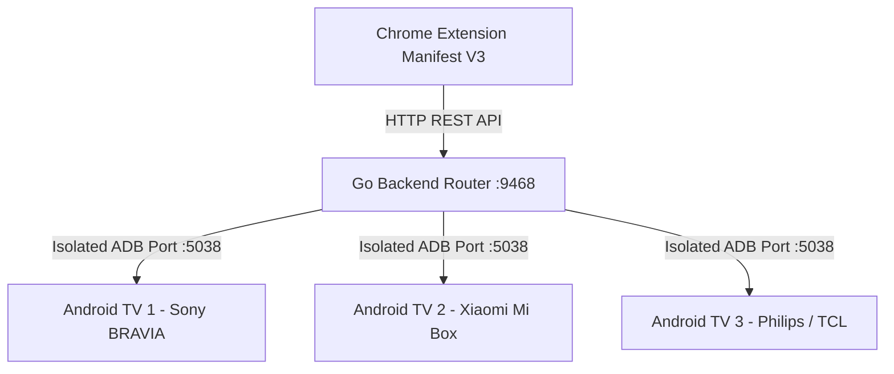

<p align="center">
  
</p>

<h1 align="center">ADB - AOSP TV Bridge Connector</h1>

<p align="center">
  <b>Dynamic Context Router & Multi-Device Cast Manager for Android TV / AOSP Devices</b>
</p>

<p align="center">
  <a href="https://www.iyc.com.tr/"></a>
  <a href="https://www.iyc.com.tr/"></a>
  
  
  
  
  
  
</p>

---

## 📌 Project Overview

**ADBCast - AOSP TV Bridge Connector** is a lightweight, high-performance solution that connects your Web Browser directly to any number of **Android TV / AOSP TV** devices across your local network (LAN) using ADB (Android Debug Bridge).

No third-party Android application installation is required on the TV! The system utilizes native Android Intents, Scoped Storage permissions, and ADB port isolation to instantly stream web pages, YouTube videos, multi-file photo/video media, and automated slideshow loops.

---

## ✨ Key Features

- 📺 **Automated LAN TV Discovery & Model Resolution**: Scans your local subnet (`192.168.1.0/24` or custom subnet) in ~2 seconds using parallel Go goroutines and retrieves exact TV model names (`getprop ro.product.model`, e.g., *Sony BRAVIA 4K*, *Xiaomi Mi Box S*).
- ☑️ **Multi-Device Broadcast**: Select single or multiple target TVs using checkboxes. Commands, web pages, media transfers, and slideshow loops are broadcast **simultaneously** to all checked TVs.
- 🖼️ **Multi-File Photo & Video Cast**: Transfer multiple photos and videos directly to TV storage (`/sdcard/Download/TVCast/`) with automatic filename sanitization (eliminates space/special character shell issues).
- 🔄 **Auto-Player Slideshow Loop**: Loop photos/videos endlessly on TV with customizable display intervals (3s, 5s, 10s, 15s). Runs continuously in the background even if the extension popup is closed!
- 🌐 **Web Browser & YouTube Cast**: Launch current webpage or YouTube video on TV with automatic browser detection (*Chrome*, *TV Bro*, *Puffin TV*, *Firefox for TV*).
- 🛑 **One-Click TV App Cleaner**: Instantly force-stop all running TV apps/media players and return the TV screen to the clean Home Launcher (`KEYCODE_HOME`).
- 🔒 **ADB Server Port Isolation**: Operates on isolated ADB server port `5038` to prevent version conflicts with Android Studio, emulators, or third-party ADB clients.
- ⚙️ **Automated Service Installers**: Includes one-click background service installers for both **Windows** (PowerShell / Scheduled Task) and **Linux** (Systemd Unit).

---

## 🎨 Architecture Overview



---

## 📸 User Interface & Features Walkthrough

### 1. 📺 Tab 1: TV Devices (LAN Scanner & Multi-Selection)
Automatically scans local network IP blocks, detects connected TV devices with model names, and allows multi-device checkbox selection for simultaneous command broadcasting.

<p align="center">
  
</p>

---

### 2. 🌐 Tab 2: Web Cast (Browser & YouTube TV Cast)
Cast active webpages or YouTube videos directly to your selected TV(s) with custom browser selection.

| Web Browser Cast | YouTube TV Cast |
| :---: | :---: |
|  |  |

---

### 3. 🖼️ Tab 3: Media Cast & Auto-Player Slideshow Loop
Upload multiple photo/video files, view active TV media files, play individual items, or start an automated background slideshow loop with custom time intervals.

<p align="center">
  
</p>

---

### 4. ⚙️ Tab 4: Settings (Subnet IP Block & Server Config)
Configure target LAN IP subnet blocks (e.g. `192.168.1.`, `10.0.0.`) and Go server port settings.

<p align="center">
  
</p>

---

## 🛒 Chrome Web Store Publishing Guide

The extension source code inside the `extension/` directory is 100% store-ready for submission to the **Chrome Web Store Developer Console**:

1. Select all files inside the `extension/` folder (`manifest.json`, `popup.html`, `popup.js`, `icon.png`, `icon.svg`).
2. Compress into a single `.zip` file (e.g. `adbcast-extension-v1.1.0.zip`).
3. Upload to the [Chrome Web Store Developer Dashboard](https://chrome.google.com/webstore/devconsole).
4. **Developer Details**:
   - **Author**: Fatih Şahin ŞEN
   - **Email**: [fatihsahinsen@outlook.com](mailto:fatihsahinsen@outlook.com)
   - **Official Web Site**: [IYC Yazılım - https://www.iyc.com.tr/](https://www.iyc.com.tr/)

---

## 🚀 Installation & Setup Guide

### 1. Prerequisites
- **Go 1.22+** (if building from source).
- **Android TV / AOSP Device** connected to the same LAN with **Network ADB Debugging enabled** (Port 5555).

---

### 2. Go Backend Server Setup

#### Option A: Quick Start (Binary)
```bash
# Build executable
go build -v -o adb-connector-server.exe main.go

# Run server
./adb-connector-server.exe
```

#### Option B: Automated Service Installation (Windows)
Run Command Prompt as **Administrator** in project root:
```cmd
install-service-windows.bat
```
*(This registers `ADBTVBridgeConnector` as an automated startup background service).*

#### Option C: Automated Service Installation (Linux Systemd)
Run terminal command with **root/sudo**:
```bash
chmod +x install-service-linux.sh
sudo ./install-service-linux.sh
```

---

### 3. Chrome Extension Setup

1. Open **Google Chrome** and navigate to `chrome://extensions/`.
2. Enable **Developer mode** in the top-right corner.
3. Click **Load unpacked** (Paketlenmemiş öge yükle).
4. Select the `extension/` directory inside this repository.
5. Click the extension icon in Chrome to open the control panel!

---

## ⚙️ Configuration (`config.json`)

The server configuration file is automatically created in the workspace root:

```json
{
  "ip_address": "192.168.1.98",
  "port": "5555",
  "server_port": "9468",
  "subnet_prefix": "192.168.1.",
  "selected_ips": [
    "192.168.1.45",
    "192.168.1.88"
  ],
  "devices": [
    {
      "ip": "192.168.1.45",
      "port": "5555",
      "name": "BRAVIA 4K UR3 (192.168.1.45)",
      "model": "BRAVIA 4K UR3"
    }
  ]
}
```

---

## 🔌 HTTP API Endpoints

| Endpoint | Method | Description |
| :--- | :---: | :--- |
| `/get_config` | `GET` | Returns current Go server configuration |
| `/set_config` | `GET/POST` | Updates server port and active IP |
| `/scan_network` | `GET/POST` | Runs LAN subnet scan and returns detected TVs |
| `/get_devices` | `GET` | Returns saved TV devices list |
| `/select_devices` | `POST` | Sets active target TV IP list (`?ips=IP1,IP2`) |
| `/get_browsers` | `GET` | Returns list of installed TV web browsers |
| `/launch_intent` | `GET` | Launches Web URL or YouTube on target TVs |
| `/cast_media` | `POST` | Transfers photos/videos to TV & starts playback |
| `/list_uploaded_media`| `GET` | Lists active uploaded media files |
| `/play_media` | `GET` | Plays specific file on target TVs (`?filename=...`) |
| `/delete_media` | `POST` | Deletes specific media file from PC & TV |
| `/clear_media` | `POST` | Clears all uploaded media from PC & TV |
| `/start_slideshow` | `POST` | Starts automated slideshow loop (`?interval=5`) |
| `/stop_slideshow` | `POST` | Stops background slideshow loop |
| `/slideshow_status` | `GET` | Returns status of active slideshow loop |
| `/close_all_apps` | `POST` | Force-stops TV apps & sends `KEYCODE_HOME` |

---

## 👤 Author & Developer

- **Developer**: Fatih Şahin ŞEN
- **Email**: [fatihsahinsen@outlook.com](mailto:fatihsahinsen@outlook.com)
- **Official Web Site**: [IYC Yazılım - https://www.iyc.com.tr/](https://www.iyc.com.tr/)

---

## 🛡️ License

This project is licensed under the **MIT License**.
